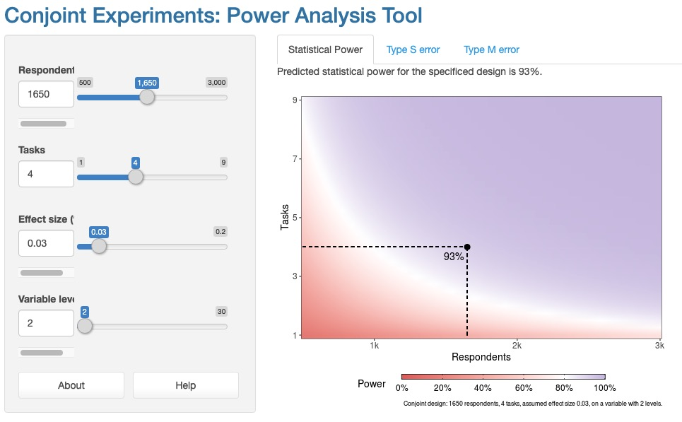

---
output:
  bookdown::pdf_document2:
  # bookdown::word_document2:
  #   reference_docx: "word-template.docx"
    toc: no
    number_sections: no
    pandoc_args: !expr rmdfiltr::add_wordcount_filter(rmdfiltr::add_citeproc_filter(args = NULL))
    latex_engine: xelatex
    keep_tex: no

header-includes:
  # - \usepackage{setspace}\doublespace
  - \usepackage{bbm}
  - \usepackage{fancyhdr}
  - \pagestyle{fancy}
  # - \setlength{\headheight}{15pt}
  - \lhead{\textit{Pregistration}}
  - \rhead{\textit{Sexuality, Cultural Similarity, and Immigrant Deservingness}}
editor_options: 
  
  chunk_output_type: console
citeproc: no
# fontfamily: mathpazo
# mainfont: "Times New Roman"
# fontsize: 12pt
geometry: margin=1in
indent: yes
link-citations: yes
linkcolor: blue
bibliography: "/Users/nathan/My Drive/Projects/2020 Same-Sex Immigrant Couples/ssimm/Same-Sex Immigration.bib"
#csl: chicago-author-date.csl

title: "Pilot Study Results and Code"
subtitle: "Sexuality, Cultural Similarity, and Immigrant Deservingness"


# date: "`r format(Sys.time(), '%B %e, %Y')`"
# author:
# - Nathan I. Hoffmann, Department of Sociology, University of California, Los Angeles
# - Kristopher Velasco, Department of Sociology, Princeton University

---

\newcommand{\tabitem}{~~\llap{\textbullet}~~}


```{r setup}
knitr::opts_chunk$set(echo = T, warning = F, message = F, cache = T, 
                      dpi = 300)
library(here)
library(huxtable)
library(haven)
library(patchwork)
library(cregg)
library(rdss)
library(DeclareDesign)
library(tidyverse)

options("yaml.eval.expr" = TRUE)

theme_set(theme_classic(base_family = 'Palatino') + 
            theme(legend.title=element_blank(),
                  panel.grid.major.y = element_line('grey80'),
                  legend.background = element_rect(fill = "transparent")))
ggplot <- function(...) ggplot2::ggplot(...) + scale_color_brewer(palette="Dark2") +
  scale_fill_brewer(palette="Dark2")
```

# Pilot Study Results

We conducted a pilot study of 100 respondents using Prolific Academic, showing each respondent two sets of profiles. For LG profiles, we see an AMCE effect size of 0.032 in the expected direction (Figure 1); respondents are 3.2 percent more likely to choose a gay or lesbian immigrant for admission to the U.S. Furthermore, there is evidence of an interaction between sexuality and reason for departure: LG profiles fleeing persecution are more likely to be chosen than straight ones fleeing persecution (Figure 2). Subgroup analyses show that respondents without a bachelor's degree, Republicans, Christians, and straight respondents see LG migrants as less deserving (Figure 3). 

```{r load}
prolific_demo <- read_csv(here('survey', 'prolific_demo.csv')) 
pilot_raw <- read_csv(here('survey', 'pilot.csv')) %>%
  mutate(StartDate = lubridate::mdy_hm(StartDate)) %>%
  filter(prolific_pid %in% prolific_demo$`Participant id`) %>%
  filter(str_detect(tolower(attention_color_5_TEXT), 'green') & 
           str_detect(as.character(attention_number_6_TEXT), '9')) 

pilot <- pilot_raw %>%
  #mutate(choice1 = Q3, choice2 = Q3, choice3 = Q13, choice4 = Q13) %>%
  pivot_longer(c(gender1:reason4, rating1:value2, rating3:value4), 
               names_to = c('.value', 'number'), names_pattern = ('(.*)(\\d+)')) %>%
  filter(!is.na(gender)) %>%
  mutate(chosen = case_when(
    choice_a == 'Immigrant 1' & number == 1 ~ 1,
    choice_a == 'Immigrant 2' & number == 2 ~ 1,
    choice_b == 'Immigrant 3' & number == 3 ~ 1,
    choice_b == 'Immigrant 4' & number == 4 ~ 1,
    T ~ 0),
    sexuality = factor(ifelse(sexuality %in% c('lesbian', 'gay'), 'lesbian or gay', 'straight'), 
                       levels = c('straight', 'lesbian or gay')),
    across(c(gender, sexuality, gdp, skill, lang, religion, reason), function(x) factor(x)),
    across(c(rating, value), function(x) as.numeric(substr(x, 1,1)))) %>%
  mutate(skill = recode(skill, 
                        'has a high school degree, and works as a restaurant manager' = 
                          'high school',
                        'has a primary school education, and works as a cleaner' = 
                          'primary school',
                        'has an MD, and works as a cardiologist' = 'MD'),
         reason = recode(reason, 'could not find work due to high unemployment' = 
                           'could not find work'),
         resp_religion = factor(case_when(
           resp_religion %in% c('Other Christian', '
                                Protestant (Baptist, Methodist, Non-denominational, Lutheran, Presbyterian, Pentecostal, Episcopalian, Reformed, Church of Christ, Jehovah’s Witness, etc.)',
                                'Roman Catholic (Catholic)') ~ 'Christian',
           resp_religion %in% c('Agnostic (not sure if there is a God)',
                                'Atheist (do not believe in God)',
                                'Nothing in particular') ~ 'Atheist/not religious',
           T ~ 'Other')),
         resp_politics = factor(ifelse(
             resp_politics %in% c('Independent', 'None of these'), 'other',
             resp_politics)),
         resp_sexuality = factor(case_when(
           resp_sexuality %in% c("I don't know the answer", 'Something else') ~ 'Other',
           resp_sexuality %in% c('Bisexual', 'Lesbian or gay') ~ 'Lesbian/gay/bisexual',
           resp_sexuality == 'Straight (that is, not gay or lesbian)' ~ 'Straight'
         )),
         resp_education = factor(resp_education)
  )


# pilot <- pilot %>% slice(rep(row_number(), each = 10)) %>%
#   mutate(prolific_pid = 1:n())

```


```{r general, fig.height = 3, fig.cap = 'Estimated marginal means and AMCEs for Prolific Academic pilot study of 100 respondents each shown 2 sets of profiles. Standard errors are clustered within respondent.'}
(plot(mm(pilot, chosen ~  sexuality, 
        id = ~prolific_pid)) + geom_vline(xintercept = 0.5, size = .2)) +
  plot(cj(pilot, chosen ~  sexuality, 
        id = ~prolific_pid)) &
  theme()
```

```{r interaction, fig.height = 3, fig.cap = 'Marginal means of the interaction between sexuality and the reason for migration'}
int_cj <- cj(pilot, chosen ~ sexuality, id = ~prolific_pid, estimate = 'mm', 
             by = ~reason)
int_cj_dif <- cj(pilot, chosen ~ sexuality, id = ~prolific_pid, estimate = 'mm_diff', 
                 by = ~reason)
rbind(int_cj, int_cj_dif) %>%
  mutate(BY = recode(BY, 'could not find work' = 'work',
                     'feared government persecution' = 'persecution',
                     'feared government persecution - could not find work' = 
                       'persecution - work')) %>%
  plot() + 
  ggplot2::facet_wrap(~BY, ncol = 3) +
  # geom_vline(xintercept = 0.5, size = .2)
  geom_vline(aes(xintercept = ifelse(statistic == 'mm', 0.5, 0)), size = .2)
```

\newpage

```{r subgroups, fig.height = 5, fig.cap = 'Marginal means for subgroups'}
pilot <- pilot %>%
  mutate(BA = factor(case_when(
    resp_education == "Bachelor's degree or higher" ~ 'BA',
    resp_education != "Bachelor's degree or higher" ~ 'no BA',
  )))

(plot(cj(pilot, chosen ~ sexuality, estimate = 'mm',
        id = ~prolific_pid, by = ~ BA),
        group = 'BA') +
  geom_vline(xintercept = .5, size = .2) +
  theme(legend.position = 'right')) /
(plot(cj(pilot, chosen ~ sexuality, estimate = 'mm',
        id = ~prolific_pid, by = ~ resp_politics),
        group = 'resp_politics') +
  geom_vline(xintercept = .5, size = .2) +
  theme(legend.position = 'right')) /
(plot(cj(pilot, chosen ~ sexuality, estimate = 'mm',
        id = ~prolific_pid, by = ~resp_religion),
        group = 'resp_religion') +
  geom_vline(xintercept = .5, size = .2) +
  theme(legend.position = 'right')) /
(plot(cj(pilot, chosen ~ sexuality, estimate = 'mm',
        id = ~prolific_pid, by = ~ resp_sexuality),
        group = 'resp_sexuality') +
  geom_vline(xintercept = .5, size = .2) +
  theme(legend.position = 'right'))
```

\newpage

# Power analysis

We perform a power analysis using the Shiny App Power Analysis Tool created by @stefanelli_2020_subjects. With 1,650 respondents, 4 tasks, and an effect size of 0.032 (as estimated in the pilot study) for an attribute with two levels, the power analysis suggests that the predicted statistical power is 93 percent.




